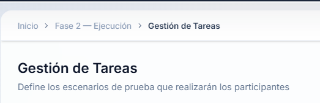
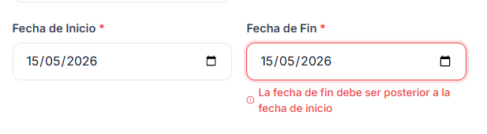

# Implementación Funcional — Mejoras UX

Este directorio documenta las mejoras UX implementadas en el sistema.

## Mejoras Implementadas

### 1. Breadcrumbs Dinámicos (`Layout.tsx`)
- Navegación jerárquica: Inicio > Fase > Sección
- Cada segmento es un enlace clickeable
- Markup semántico `<nav aria-label="breadcrumb">`
- **Heurísticas resueltas:** P-04

Antes y despues:

### 2. Stepper de Progreso de Fases (`Dashboard.tsx`)
- 3 fases visuales: Preparación → Ejecución → Análisis
- Estados: completado ✓, activo ◉, bloqueado 🔒
- Contador de sub-secciones completadas
- Micro-animación de pulso en fase activa
- **Heurísticas resueltas:** P-01, P-06

antes y despues:

### 3. Quick Actions (`Dashboard.tsx`)
- Tarjetas de acción rápida con navegación directa
- Muestra las 3 próximas tareas pendientes
- Se ocultan automáticamente al completarse
- **Heurísticas resueltas:** P-08, P-10

### 4. Barra de Progreso Global (`Dashboard.tsx`)
- Porcentaje de completitud del plan (7 secciones)
- Gradiente visual blue → indigo → emerald
- Mensaje de celebración al 100%
- **Heurísticas resueltas:** P-01, P-06

### 5. Validaciones Inline en Formularios (`TestPlans.tsx`)
- Validación en tiempo real al perder foco
- Bordes rojo (error) / verde (correcto) en campos
- Mensajes descriptivos debajo de cada campo
- Validación de coherencia de fechas
- Spinner de carga en botón de guardado
- **Heurísticas resueltas:** P-03, P-09, P-11

### 6. Estilos CSS (`index.css`)
- `.phase-stepper` con animaciones y estados
- `.quick-action` con hover effects
- `.field-error` / `.field-success` / `.field-hint`
- Responsive para mobile

## Archivos Modificados

| Archivo | Cambios |
|---------|---------|
| `frontend_beta/src/components/Layout.tsx` | Breadcrumbs dinámicos |
| `frontend_beta/src/pages/Dashboard.tsx` | Stepper + Quick Actions + Progress Bar |
| `frontend_beta/src/pages/TestPlans.tsx` | Validaciones inline |
| `frontend_beta/src/index.css` | Nuevos estilos UX |

## Principios HCI Aplicados

- **Gestalt (Proximidad):** KPIs agrupados por categoría
- **Jerarquía Visual:** Stepper → Quick Actions → Banner → KPIs
- **Prevención de Errores:** Validaciones inline en tiempo real
- **Navegación Contextual:** Breadcrumbs + Quick Actions
- **Diseño Emocional:** Micro-animaciones, gradientes, mensaje de celebración
- **Reconocimiento > Recuerdo:** Progreso visible sin necesidad de memorizar
