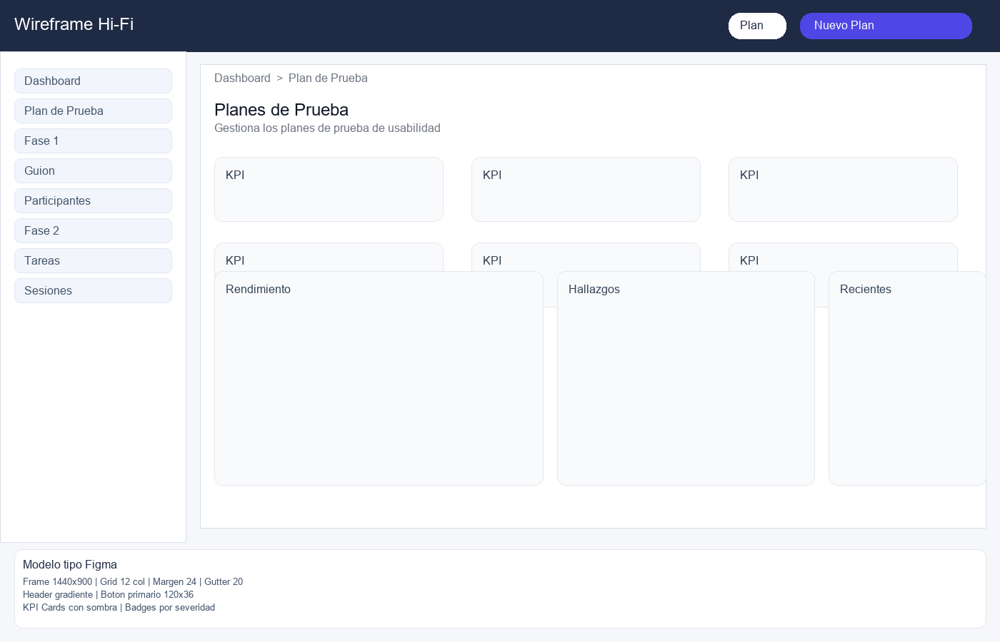

# Wireframe Hi-Fi — Dashboard

Autor: Josue Fiallos
Duracion: 2 horas




Objetivo: definir detalles visuales, color y feedback.

```
[Header Glass]  [Plan: Proyecto X]  [Selector]

Breadcrumbs: Dashboard > Fase 2 — Ejecucion > Observaciones

[Hero Banner]
- Titulo destacado
- Resumen en texto
- Chip de estado

[KPI Cards]
- Colores por categoria
- Iconos claros
- Numeros grandes

[Grid de Analitica]
- Tarjeta 1: Progreso por tarea (barras)
- Tarjeta 2: Pie de severidad
- Tarjeta 3: Hallazgos recientes con badges

[Estado de Acciones]
- Contadores grandes
- Barra de progreso segmentada
- Etiqueta de porcentaje
```

Detalles
- Jerarquia por contraste y tamanos.
- Breadcrumbs con enlaces y separadores.
- Prevencion de errores con estados claros.
- Microcopy breve en secciones clave.
- Colores consistentes por severidad.

## Sistema visual (resumen)
| Elemento | Tratamiento |
| --- | --- |
| KPIs | Numeros grandes, color por categoria |
| Hallazgos | Badges por severidad |
| Acciones | Barra segmentada + porcentaje |

## Feedback visual
- Estados de carga con texto de apoyo.
- Resaltado de la pagina actual en breadcrumbs.

## Modelo tipo Figma (Hi-Fi)
| Elemento | Especificacion |
| --- | --- |
| Frame | 1440x900, fondo #F6F7FB |
| Grid | 12 columnas, margen 24, gutter 20 |
| Header | Gradiente oscuro, altura 72 |
| Boton primario | 120x36, radio 16, color #4F46E5 |
| KPI Cards | Sombra suave, icono + valor grande |
| Badges | 80x24, colores por severidad |
| Tipografia | Titulos 24, cuerpo 14, labels 12 |

