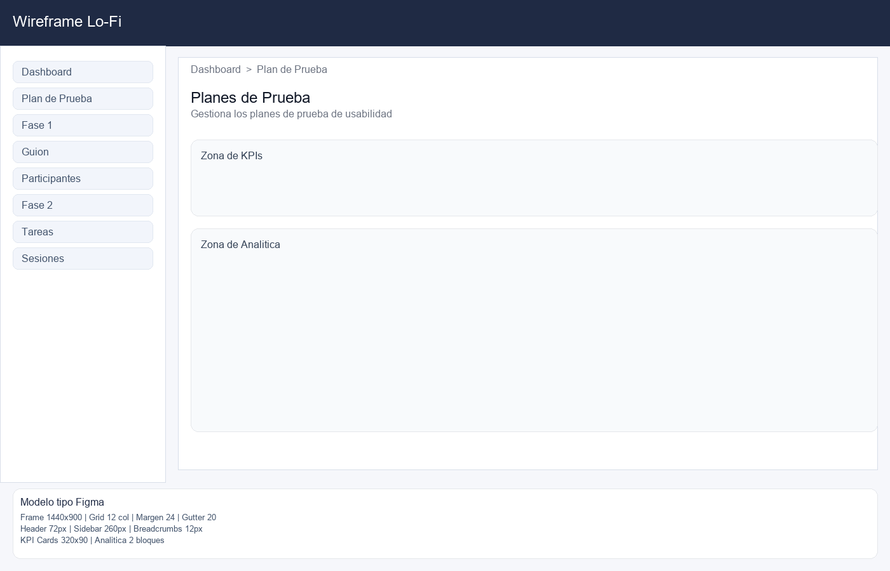
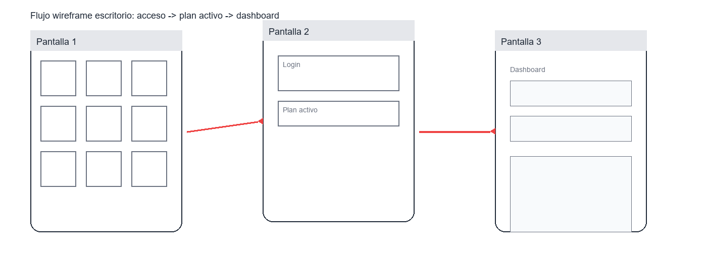

# Wireframe Lo-Fi — Dashboard

Autor: Josue Fiallos
Duracion: 2 horas





Objetivo: definir estructura base y bloques principales.

```
+--------------------------------------------------------------+
| Header: Plan Activo + Selector                               |
+-----------------------+--------------------------------------+
| Sidebar (Fases)        | Breadcrumbs                          |
| - Dashboard            | Dashboard / Seccion                  |
| - Plan de Prueba       |--------------------------------------|
| - Fase 1               | Hero / Resumen                        |
| - Fase 2               |--------------------------------------|
| - Fase 3               | KPI Cards (4)                         |
|                        | KPI Cards (4)                         |
|                        |--------------------------------------|
|                        | Graficas / Hallazgos / Acciones       |
+-----------------------+--------------------------------------+
```

Notas
- Estructura de 2 columnas.
- Jerarquia por bloques verticales.
- Zona de navegacion siempre visible.
- Area de KPIs priorizada sobre analitica secundaria.

## Componentes clave
| Bloque | Proposito |
| --- | --- |
| Header | Contexto activo y selector de plan |
| Sidebar | Navegacion por fases |
| Breadcrumbs | Ubicacion contextual |
| KPIs | Lectura rapida de estado |
| Analitica | Profundizacion por tarea |

## Principios aplicados
- Gestalt: proximidad y agrupacion por bloques.
- Jerarquia: KPIs antes que analitica detallada.

## Modelo tipo Figma (Lo-Fi)
| Elemento | Especificacion |
| --- | --- |
| Frame | 1440x900, fondo #F6F7FB |
| Grid | 12 columnas, margen 24, gutter 20 |
| Header | Altura 72, fondo #1F2A44 |
| Sidebar | 260px, fondo blanco, items 34px |
| Contenedor | Card principal con padding 20 |
| Tipografia | Sans regular 16, titulo 24 |
| Componentes | Cards de KPIs, bloques de analitica |

