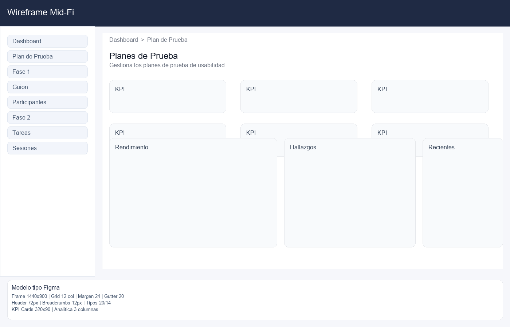

# Wireframe Mid-Fi — Dashboard

Autor: Josue Fiallos
Duracion: 2 horas




Objetivo: definir jerarquia visual y navegacion contextual.

```
+---------------------------------------------------------------------+
| Header: Contexto Activo | Selector Plan | Estado                     |
+-------------------------+-------------------------------------------+
| Sidebar (Fases)          | Breadcrumbs: Dashboard > Fase > Seccion   |
| - Dashboard              |-------------------------------------------|
| - Plan de Prueba          | Hero: Resumen del Plan                    |
| - Fase 1                  |-------------------------------------------|
| - Fase 2                  | KPI Row 1 (Observaciones, Exito, Tiempo)  |
| - Fase 3                  | KPI Row 2 (Hallazgos, Mejoras)            |
|                          |-------------------------------------------|
|                          | Col 1: Rendimiento por Tarea              |
|                          | Col 2: Pie Hallazgos                        |
|                          | Col 3: Hallazgos Recientes                 |
|                          |-------------------------------------------|
|                          | Estado de Acciones (barra + contadores)    |
+-------------------------+-------------------------------------------+
```

Notas
- Breadcrumbs visibles para orientacion.
- Bloques agrupados por tarea (Gestalt: proximidad).
- Titulos y subtitulos con contraste moderado.
- Espaciado consistente para lectura en escaneo.

## Reglas de layout
| Regla | Justificacion UX |
| --- | --- |
| Grid 3 columnas | Comparacion rapida de datos |
| Secciones con titulos | Reconocimiento inmediato |
| Separadores suaves | Reduce ruido visual |

## Navegacion contextual
- Breadcrumbs muestran fase y seccion.
- Sidebar indica fases y avance.

## Modelo tipo Figma (Mid-Fi)
| Elemento | Especificacion |
| --- | --- |
| Frame | 1440x900, fondo #F6F7FB |
| Grid | 12 columnas, margen 24, gutter 20 |
| Header | Altura 72, fondo #1F2A44 |
| Breadcrumbs | Texto 12, color #6B7280 |
| KPI Cards | 320x90, radio 12, borde #E5E7EB |
| Analitica | 3 columnas, altura 300 |
| Tipografia | Titulos 20-24, cuerpo 14-16 |

