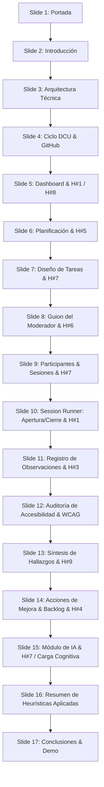

# Guion para Presentación de Diapositivas: Usability Test Dashboard 2.0 📊🧠
**Asignatura:** Interacción Humano-Computador (HCI)  
**Proyecto:** Plataforma para Planificación, Ejecución y Análisis de Pruebas de Usabilidad e Inclusión

Este guion está diseñado para estructurar una presentación académica y técnica de **17 diapositivas**, cubriendo desde la conceptualización hasta la aplicación rigurosa de las **Heurísticas de Nielsen** y principios de HCI en cada módulo del proyecto, vinculándolos directamente con el código fuente.

---

## Estructura de las Diapositivas e Integración HCI

---

### 🎴 Diapositiva 1: Portada y Presentación del Ecosistema
* **Título de la diapositiva:** Usability Test Dashboard 2.0: Evaluando Experiencias bajo el Enfoque HCI
* **Diseño Visual Sugerido:** 
  * Fondo azul marino profundo (`#1E2761`) con acentos celestes y formas circulares sutiles con transparencia.
  * Iconos grandes: Gráfico de barras y cerebro (`📊🧠`).
  * Subtítulos con tipografía moderna y limpia (ej. *Inter* o *Outfit*).
* **Contenido Clave en Pantalla:**
  * **Ecosistema Completo:** Planificación, Ejecución, Análisis e IA.
  * **Caso de Estudio Inicial:** Comparativa de Usabilidad de freeCodeCamp vs. Coursera.
  * **Herramientas de Auditoría:** WAVE, Lighthouse, Stark, Observaciones Manuales.
* **Guion del Orador (Exposición):**
  > "Buenos días, profesor y compañeros. Hoy presentaremos el *Usability Test Dashboard 2.0*, una plataforma web de nivel profesional desarrollada específicamente para centralizar e instrumentar el ciclo completo del Diseño Centrado en el Usuario. A través de este dashboard, no solo recopilamos datos métricos tradicionales, sino que auditamos heurísticamente y bajo estándares internacionales de accesibilidad la interacción con interfaces. Ilustraremos su funcionamiento práctico mediante un caso de estudio comparativo entre dos grandes plataformas de aprendizaje: freeCodeCamp y Coursera."
* **Término HCI Aplicado:** **Diseño Centrado en el Usuario (DCU)** (mecanismo que pone las necesidades, capacidades y limitaciones humanas en el centro del diseño de software).

---

### 🎴 Diapositiva 2: Introducción y Propósito del Proyecto
* **Título de la diapositiva:** ¿Qué es el Sistema y Por Qué es Necesivo?
* **Diseño Visual Sugerido:** 
  * Fondo claro (`#F5F7FA`) con tarjeta central blanca con sombra y borde izquierdo con acento azul (`#4A90D9`).
  * Icono de objetivo (`🎯`) en grande.
* **Contenido Clave en Pantalla:**
  * **El Problema:** La falta de herramientas unificadas para moderar pruebas *Think Aloud*, tomar tiempos y registrar errores en vivo.
  * **La Solución:** Centralizar la definición del plan, la ejecución de la prueba guiada y el seguimiento de mejoras.
  * **Público Objetivo:** Moderadores de pruebas, evaluadores HCI, investigadores UX y diseñadores.
* **Guion del Orador (Exposición):**
  > "En el desarrollo de software convencional, las pruebas de usabilidad se ejecutan de manera informal o fragmentada: guiones en PDFs, cronómetros en teléfonos, notas en papel y capturas de accesibilidad dispersas. Esto genera una gran pérdida de contexto. Nuestro sistema nace para resolver este dolor de cabeza. Su propósito es proveer un entorno unificado que guíe al moderador en tiempo real mientras registra métricas cuantitativas como tasas de éxito y tiempos, y hallazgos cualitativos alineados a las directrices de la interacción humano-computador."
* **Términos HCI Aplicados:** **Método Think Aloud** (pensar en voz alta mientras se interactúa con el sistema) y **Evaluación Empírica** (observación directa del comportamiento de usuarios reales).

---

### 🎴 Diapositiva 3: Arquitectura Técnica del Ecosistema
* **Título de la diapositiva:** Arquitectura Limpia e Interfaz Reactiva
* **Diseño Visual Sugerido:** 
  * Diagrama de 4 columnas que representen las capas de la arquitectura:
    1. **Frontend (Vite + React)** (Azul: `#3B82F6`)
    2. **Backend (.NET Web API)** (Púrpura: `#8B5CF6`)
    3. **Persistencia (EF Core + SQL Server)** (Verde: `#10B981`)
    4. **Calidad (CORS & Middlewares)** (Ámbar: `#F59E0B`)
* **Contenido Clave en Pantalla:**
  * **Frontend:** React 19 + TypeScript, Tailwind CSS, Lucide Icons, React Router DOM.
  * **Backend:** ASP.NET Core 10 Web API siguiendo principios de *Clean Architecture*.
  * **Base de Datos:** SQL Server, acceso por Entity Framework Core con enfoque *Code First*.
* **Guion del Orador (Exposición):**
  > "Para garantizar un sistema robusto, escalable y con excelente desempeño, implementamos un backend con Arquitectura Limpia en ASP.NET Core 10 y Entity Framework Core. Esta separa el Dominio de las reglas de aplicación y la persistencia de base de datos en SQL Server. El frontend fue estructurado como una Single Page Application (SPA) responsiva con React 19, TypeScript y Vite, lo que permite actualizaciones reactivas e inmediatas en la interfaz de usuario, garantizando una interacción fluida y sin recargas molestas de página."
* **Términos HCI Aplicados:** **Eficiencia de la Interacción** (mediante la arquitectura SPA y cargas asíncronas que disminuyen los tiempos de espera del usuario evaluador) y **Feedback Técnico**.

---

### 🎴 Diapositiva 4: Ciclo de Desarrollo Centrado en el Usuario (GitHub Projects + HCI)
* **Título de la diapositiva:** Integración del Ciclo de Desarrollo ⇄ Usabilidad
* **Diseño Visual Sugerido:** 
  * Diagrama de flujo horizontal que represente el ciclo de vida de los cambios:
    `[Figma/Wireframes] ➔ [GitHub Issue (MoSCoW)] ➔ [Feature Branch] ➔ [Copilot AI] ➔ [Pull Request + HCI Checklist] ➔ [Merge]`
* **Contenido Clave en Pantalla:**
  * **Planificación:** Tablero de GitHub Projects bajo metodología de priorización MoSCoW.
  * **Auditoría de PRs:** No hay merge a `main` sin completar un Checklist de usabilidad y accesibilidad.
  * **Rol de la IA:** Copilot como copiloto para optimización de estructura semántica (`aria-label`) y prevención de errores lógicos.
* **Guion del Orador (Exposición):**
  > "El desarrollo del dashboard no fue aleatorio. Adoptamos un enfoque ágil de Diseño Centrado en el Usuario de la mano con GitHub. Cada historia de usuario y requerimiento técnico se priorizó mediante MoSCoW. Al momento de codificar, utilizamos IA (GitHub Copilot) para asistirnos en el cumplimiento de estándares semánticos de accesibilidad. Y finalmente, implementamos un mecanismo de Pull Requests en el que ningún cambio se fusiona si no cumple y evidencia la validación de un principio de usabilidad."
* **Términos HCI Aplicados:** **Diseño Iterativo** (desarrollo y refinamiento continuo basado en evaluación de usabilidad) y **Auditoría de Usabilidad**.

---

### 🎴 Diapositiva 5: Módulo 1 — Dashboard de Control Inteligente
* **Título de la diapositiva:** Dashboard de Control Inteligente
* **Diseño Visual Sugerido:** 
  * Captura de pantalla o mock del dashboard mostrando las tarjetas de KPIs (Tasa de éxito, Tiempo promedio, Hallazgos críticos).
  * Render del *Phase Stepper* en la parte superior.
* **Contenido Clave en Pantalla:**
  * **Visualización de KPIs:** Tasa de éxito promedio, duración de sesiones y criticidad de hallazgos.
  * **Phase Stepper (Preparación, Ejecución, Análisis):** Indica visualmente en qué etapa del plan global se encuentra el evaluador.
  * **Acciones Rápidas (Quick Actions):** Sugerencias proactivas y atajos dinámicos para guiar al usuario.
* **Guion del Orador (Exposición):**
  > "El primer módulo es el Dashboard de Control Inteligente. El objetivo del diseño es evitar que el evaluador se sienta abrumado por datos crudos. Mostramos KPIs consolidados con tarjetas visualmente limpias. Además, implementamos un Stepper de progreso global por fases y un sistema de control de accesibilidad ('Quality Gates') que restringe o habilita las secciones basándose en el estado del plan. Si no se han cargado participantes o guiones, el sistema bloquea la ejecución de sesiones para prevenir bases de datos inconsistentes."
* **Heurísticas de Nielsen Aplicadas:** 
  * **Heurística #1 (Visibilidad del estado del sistema):** El Stepper de progreso espacializa al usuario y le indica su ubicación y estado global.
  * **Heurística #8 (Estética y diseño minimalista):** Tarjetas de KPI simplificadas que reducen el esfuerzo de interpretación y evitan la sobrecarga cognitiva.

---

### 🎴 Diapositiva 6: Módulo 2 — Planificación de Pruebas de Usabilidad
* **Título de la diapositiva:** Módulo de Planes de Prueba (Test Plans)
* **Diseño Visual Sugerido:** 
  * Vista de formulario con validaciones inline en rojo/verde y modales interactivos.
  * Captura de la tabla del listado de planes en el sistema.
* **Contenido Clave en Pantalla:**
  * **Gestión de Planes (CRUD):** Registro de nombre del proyecto, objetivo general, perfil de usuario meta y metodología.
  * **Plan Activo Global:** Concepto de 'Plan de Prueba Activo' persistente en toda la navegación.
  * **Validaciones Preventivas:** Fechas cruzadas y campos incompletos bloquean preventivamente el envío de datos.
* **Guion del Orador (Exposición):**
  > "El Módulo de Planes de Prueba permite al moderador estructurar el estudio. Aquí se define qué se evaluará (por ejemplo, barra de búsqueda e inscripciones en freeCodeCamp vs Coursera), la duración estimada de cada sesión y el perfil de los usuarios finales (como estudiantes de ingeniería de software con experiencia en laptops). Una característica clave de usabilidad es el 'Plan Activo Global': una vez que seleccionas un plan en el header, toda la aplicación se filtra de forma automática y reactiva para mostrar solo los datos de ese plan."
* **Heurísticas de Nielsen Aplicadas:**
  * **Heurística #5 (Prevención de Errores):** El sistema valida en tiempo real los inputs del formulario e impide registrar planes inconsistentes (ej. fechas de fin anteriores a las de inicio).
  * **Contexto Persistente:** Se minimiza el esfuerzo de navegación al mantener el plan activo de forma global en el menú superior.

---

### 🎴 Diapositiva 7: Módulo 3 — Diseño de Tareas y Criterios de Éxito
* **Título de la diapositiva:** Tareas y Escenarios de Uso
* **Diseño Visual Sugerido:** 
  * Una tabla interactiva que liste tareas con: Número de tarea, Escenario (en cursiva/comillas), Métrica Principal y Tiempo Límite.
  * Botón con destello con la leyenda: "Generar Tareas con IA".
* **Contenido Clave en Pantalla:**
  * **Modelado del Escenario:** Instrucciones contextuales realistas para el participante.
  * **Criterios de Éxito:** Definición del resultado esperado de la tarea.
  * **Métricas Principales:** Eficiencia (clics, tiempo) o tasa de errores.
  * **Asistente de IA (Gemini):** Evento contextual que genera 3 tareas ergonómicas sugeridas en base al producto.
* **Guion del Orador (Exposición):**
  > "Una prueba de usabilidad no es un cuestionario libre; se compone de tareas estructuradas. Este módulo permite definir la secuencia de escenarios que los participantes ejecutarán. Por ejemplo, en nuestro caso de estudio: 'Crea una cuenta nueva, ingresa una contraseña incorrecta a propósito y describe qué errores observas'. Para facilitar la fase de diseño, implementamos un disparador dinámico conectado al Copiloto de IA que analiza el objetivo del plan y genera instantáneamente tareas y criterios de éxito ergonómicos."
* **Heurísticas de Nielsen Aplicadas:**
  * **Heurística #7 (Flexibilidad y eficiencia de uso):** El acelerador de IA permite a evaluadores novatos o expertos redactar tareas profesionales sin empezar desde cero.
  * **Mapeo a Modelos Mentales:** Los escenarios se diseñan desde la perspectiva del lenguaje y comportamiento natural del usuario final, no de la base de datos.

---

### 🎴 Diapositiva 8: Módulo 4 — Guion de Moderación bajo Metodología "Think Aloud"
* **Título de la diapositiva:** Módulo de Guion del Moderador (Moderator Script)
* **Diseño Visual Sugerido:** 
  * Un diseño de tarjeta de tres secciones o tabs: Introducción y bienvenida (Consentimiento), Preguntas de seguimiento durante las tareas, e Instrucciones de cierre.
* **Contenido Clave en Pantalla:**
  * **Introducción y Consentimiento:** Recordatorio de que 'se evalúa al sistema, no al participante' para calmar la ansiedad.
  * **Preguntas de Seguimiento:** Directrices y preguntas clave para extraer comentarios cualitativos.
  * **Cierre y Post-Test:** Preguntas abiertas de satisfacción del usuario.
* **Guion del Orador (Exposición):**
  > "El Guion del Moderador es vital para mantener la uniformidad y el rigor científico de las pruebas. Este módulo permite estructurar los diálogos en tres fases: la introducción (donde se tranquiliza al participante aclarando que el evaluado es el software y no él), las preguntas de seguimiento ('¿las sugerencias te guían al contenido?') y las instrucciones de cierre. Esto previene sesgos en la moderación y asegura que todos los participantes reciban el mismo nivel de inducción."
* **Heurísticas de Nielsen Aplicadas:**
  * **Heurística #6 (Reconocer en lugar de recordar):** El guion asiste al moderador durante la ejecución de las sesiones de prueba; el guion se muestra integrado al lado de la consola para no depender de la memoria de trabajo.
  * **Diseño Emocional:** El texto de introducción mitiga el estrés de evaluación y promueve una interacción natural del usuario.

---

### 🎴 Diapositiva 9: Módulo 5 — Directorio de Participantes y Agenda de Sesiones
* **Título de la diapositiva:** Participantes y Programación de Sesiones
* **Diseño Visual Sugerido:** 
  * Un listado limpio de participantes con tarjetas informativas (Nombre, Edad, Perfil) al lado de un listado de sesiones programadas mostrando la fecha y la plataforma a probar (ej. freeCodeCamp vs. Coursera).
* **Contenido Clave en Pantalla:**
  * **Perfil de Usuario (User Profile):** Registro de edad y rol técnico (ej. Analista de Software, Evaluador General).
  * **Programación Dinámica:** Asignación de fecha, participante y plataforma específica a evaluar.
  * **Enlace Rápido al Ejecutor:** Botón con icono de Play (`▶️`) que inicia de forma instantánea la experiencia de prueba guiada.
* **Guion del Orador (Exposición):**
  > "Antes de ejecutar la prueba, el moderador registra a los participantes en un directorio centralizado detallando su perfil demográfico y técnico. Posteriormente, en el submódulo de Sesiones, programa las evaluaciones asignándoles una fecha y una plataforma a testear. La interfaz muestra un diseño altamente enfocado en la eficiencia operativa: cada sesión cuenta con un botón de acceso directo que abre la interfaz interactiva de ejecución con un solo clic."
* **Heurísticas de Nielsen Aplicadas:**
  * **Heurística #7 (Flexibilidad y eficiencia de uso):** Botón de ejecución directa `▶️` que actúa como atajo directo para pasar del registro administrativo a la ejecución del test sin rodeos.
  * **Modelado de Personas:** Se facilita el registro estructurado de perfiles para asegurar la representatividad en el test.

---

### 🎴 Diapositiva 10: Módulo 6 — Ejecución Guiada (Session Runner — Apertura y Cierre)
* **Título de la diapositiva:** Session Runner: Automatizando las Fases de Prueba
* **Diseño Visual Sugerido:** 
  * Captura de pantalla del `SessionRunner` mostrando la estructura de fases: `Apertura`, `En Prueba` y `Cierre`.
  * Visualización del script del moderador cargado dinámicamente en el panel lateral.
* **Contenido Clave en Pantalla:**
  * **Flujo Secuencial (3 Fases):** Eliminación de la navegación libre para evitar distracciones en el moderador.
  * **Fase de Apertura:** Pantalla limpia con la lectura exacta de bienvenida y consentimiento de datos.
  * **Fase de Cierre:** Preguntas finales del guion y guardado integrado de las métricas en base de datos.
* **Guion del Orador (Exposición):**
  > "El corazón práctico de la aplicación es el *Session Runner*. Anteriormente, los moderadores debían saltar de pantalla en pantalla para leer el guion y registrar datos. Esta interfaz los guía secuencialmente por tres fases. En la fase de Apertura, el moderador lee la bienvenida guardada en la base de datos sin salir de la app. Al finalizar las pruebas, avanza a la fase de Cierre, donde lee las conclusiones y puede guardar la sesión completa con un botón de guardado en la base de datos."
* **Heurísticas de Nielsen Aplicadas:** 
  * **Heurística #1 (Visibilidad del estado del sistema):** Stepper activo de las fases de la sesión, informando en todo momento qué paso se está ejecutando (Apertura -> En Prueba -> Cierre).
  * **Heurística #5 (Prevención de Errores):** Diálogo de advertencia interactivo si se intenta cerrar la sesión runner antes de guardar, evitando pérdida de datos por descuidos.

---

### 🎴 Diapositiva 11: Módulo 7 — Captura Interactiva de Observaciones en Vivo (Fase de Prueba)
* **Título de la diapositiva:** Ejecución Guiada: Registro de Datos en Tiempo Real
* **Diseño Visual Sugerido:** 
  * Interfaz de la fase de pruebas del `SessionRunner`:
    * Panel principal con la tarea activa, cronómetro digital grande (`01:24`) y campos para rellenar (Tasa de Éxito, Errores, Comentarios).
    * Panel lateral interactivo con pestañas de preguntas del guion para fácil acceso.
* **Contenido Clave en Pantalla:**
  * **Cronómetro Integrado:** Permite medir la eficiencia de la tarea con un clic.
  * **Registro de Errores e Hitos:** Éxito de tarea (Checkbox), recuento de errores cometidos e observaciones cualitativas.
  * **Generación de Hallazgos en Vivo:** Permite redactar soluciones y problemas detectados mientras transcurre la prueba.
* **Guion del Orador (Exposición):**
  > "En la fase de prueba, la interfaz se transforma en una consola de observación activa. El moderador inicia el cronómetro embebido en la pantalla en cuanto el usuario comienza el escenario. Mientras el usuario habla en voz alta (Think Aloud), el moderador puede tomar anotaciones inmediatas, registrar la cantidad de errores cometidos y calificar el éxito de la tarea. Todo se captura reactivamente por cada tarea del plan mediante pestañas rápidas de navegación."
* **Heurísticas de Nielsen Aplicadas:**
  * **Heurística #3 (Control y libertad del usuario):** El moderador puede pausar el cronómetro, saltar libremente entre tareas si el participante se atasca, y deshacer el registro antes de realizar el envío definitivo.
  * **Mapeo entre el sistema y el mundo real:** El formulario se adapta cronológicamente a la dinámica natural de la prueba física de usabilidad.

---

### 🎴 Diapositiva 12: Módulo 8 — Auditoría Integrada de Accesibilidad (WAVE, Lighthouse, Stark)
* **Título de la diapositiva:** Módulo de Auditoría de Accesibilidad (Inclusión Web)
* **Diseño Visual Sugerido:** 
  * Captura de pantalla de la página de Accesibilidad mostrando los hallazgos agrupados en pestañas correspondientes a **WAVE**, **Lighthouse**, **Stark** y **Observación Manual**.
  * Iconos significativos por herramienta.
* **Contenido Clave en Pantalla:**
  * **Integración de Herramientas:** Registro y categorización de problemas de accesibilidad detectados.
  * **Clasificación por WCAG:** Asignación del nivel de conformidad (A, AA, AAA).
  * **Pautas Críticas:** Contraste de colores, ARIA/Roles, Estructura Semántica, Foco Visible e imágenes con Alt text.
* **Guion del Orador (Exposición):**
  > "El Usability Test Dashboard 2.0 va más allá de la usabilidad e incluye la Accesibilidad (A11y) como pilar fundamental de la Interacción Humano-Computador. En este módulo, los hallazgos se clasifican según la herramienta de auditoría empleada: WAVE para errores estructurales y ARIA, Lighthouse para puntuación automatizada, Stark para contraste y daltonismo, u Observaciones Manuales para navegación por teclado y soporte de lectores de pantalla."
* **Principios de Accesibilidad Web Aplicados:**
  * **Equidad en el Diseño:** Estructuración y registro sistemático conforme a las pautas de **WCAG 2.2** para asegurar que el software evaluado sea operable por todos.
  * **Soporte Semántico:** Validación semántica de los elementos interactivos usando roles ARIA y foco visible.

---

### 🎴 Diapositiva 13: Módulo 9 — Síntesis de Hallazgos y Severidad de Usabilidad
* **Título de la diapositiva:** Módulo de Hallazgos (Findings) y Escala de Gravedad
* **Diseño Visual Sugerido:** 
  * Tabla o lista de hallazgos con insignias (*badges*) de severidad con código de color:
    * `Critical` (Rojo: `#EF4444`)
    * `High` (Naranja: `#F59E0B`)
    * `Medium` (Amarillo: `#EAB308`)
    * `Low` (Verde: `#10B981`)
* **Contenido Clave en Pantalla:**
  * **Consolidación del Hallazgo:** Descripción, categoría (ej. Búsqueda, Retroalimentación) y frecuencia.
  * **Severidad de Usabilidad:** Severidad basada en el impacto en la tarea y la frustración del usuario.
  * **Recomendación Directa:** Propuesta de diseño para mitigar la fricción heurística detectada.
* **Guion del Orador (Exposición):**
  > "Una vez concluidas las sesiones de prueba, se consolidan las observaciones en la síntesis de Hallazgos. Aquí se agrupan los problemas detectados y se les asigna una prioridad de resolución y un nivel de severidad. Para que los hallazgos sean procesables, cada uno incluye un campo obligatorio de recomendación de diseño. Por ejemplo, ante el hallazgo 'Falta de indicador inscrito en el catálogo de Coursera', la recomendación de usabilidad es 'Añadir un badge de inscripción visible en la miniatura del curso'."
* **Heurísticas de Nielsen Aplicadas:**
  * **Heurística #9 (Ayudar a los usuarios a reconocer, diagnosticar y recuperarse de errores):** Clasificación semántica de la gravedad con códigos de color de semáforo que ayudan al diseñador a diagnosticar visualmente cuáles problemas requieren atención crítica.
  * **Mapeo Heurístico:** Cada hallazgo se asocia directamente a la regla heurística vulnerada.

---

### 🎴 Diapositiva 14: Módulo 10 — Acciones de Mejora y Vinculación con Sprint Backlog
* **Título de la diapositiva:** Módulo de Acciones de Mejora y Sprint Backlog
* **Diseño Visual Sugerido:** 
  * Vista dividida en dos: a la izquierda el listado de Acciones de Mejora asociadas a hallazgos, y a la derecha su mapeo directo hacia el Sprint Backlog del equipo de desarrollo, mostrando barras de progreso de implementación.
* **Contenido Clave en Pantalla:**
  * **Acción Correctiva (CRUD):** Definición técnica para implementar la recomendación de diseño de usabilidad.
  * **Integración al Backlog:** Conversión del cambio de interfaz en una tarea del sprint.
  * **Cierre de Ciclo:** Permite monitorear si un error de usabilidad detectado ya fue corregido en el código de producción.
* **Guion del Orador (Exposición):**
  > "El valor final de nuestro sistema reside en conectar los hallazgos de usabilidad con la ingeniería de desarrollo de software. El módulo de Acciones de Mejora toma un hallazgo y define la tarea técnica para corregirlo (ej. 'Implementar react-hot-toast post-inscripción'). Estas acciones se vinculan al Sprint Backlog. Así, el equipo puede rastrear si la interfaz ya se modificó y cerrar formalmente la brecha de usabilidad en la siguiente iteración de desarrollo."
* **Heurísticas de Nielsen Aplicadas:**
  * **Heurística #4 (Consistencia y Estándares):** Mapeo de soluciones de usabilidad con base en la terminología y estructura de historias estándar de Scrum ("Como/Quiero/Para"), estandarizando el lenguaje entre el evaluador UX y el programador backend/frontend.
  * **Diseño de Interacción Iterativo:** Cierre del lazo entre evaluación de usabilidad y desarrollo.

---

### 🎴 Diapositiva 15: Módulo de IA — Copiloto Contextual e Ingeniero de Usabilidad (Gemini API)
* **Título de la diapositiva:** Inteligencia Artificial al Servicio de la Usabilidad (Gemini API)
* **Diseño Visual Sugerido:**
  * Diagrama de 3 tarjetas representando las características del módulo de IA:
    1. **Chat Contextual:** Sidebar de chat integrada (`AiCopilot.tsx`).
    2. **Sugerencias de Diseño:** Generador dinámico de tareas, hallazgos y mejoras en cada sección.
    3. **Ingeniero Scrum (Sprint Backlog):** Parser JSON interactivo que crea historias y tareas.
* **Contenido Clave en Pantalla:**
  * **Asistente de Contexto:** Lee la pantalla activa y sus datos JSON para brindar respuestas enfocadas y precisas.
  * **Generador de Backlog en 1-Clic:** Gemini analiza las observaciones y hallazgos en cascada y genera el Sprint Backlog.
  * **Inserción de Historias e Hitos:** Interfaz que renderiza las sugerencias de la IA como tarjetas accionables con *checkboxes*.
* **Guion del Orador (Exposición):**
  > "El valor diferencial de nuestra plataforma es el Módulo de Inteligencia Artificial context-aware. En lugar de ser un simple chatbot genérico, este asistente (`AiCopilot.tsx`) está integrado directamente en la interfaz. Cuando el usuario navega a 'Tareas', la IA comprende su contexto y ofrece sugerir tareas ergonómicas. En la sección del Backlog, Gemini recopila la información de todas las sesiones en cascada, analiza los incidentes de usabilidad y los traduce a historias Scrum en formato JSON de forma inmediata."
* **Heurísticas de Nielsen & Principios de HCI Aplicados:**
  * **Heurística #7 (Flexibilidad y Eficiencia de Uso):** Los aceleradores y atajos provistos por la IA reducen el esfuerzo de escritura de datos repetitivos.
  * **Reducción de Carga Cognitiva:** La IA asume la carga semántica de traducir observaciones sueltas en historias Scrum, definiendo criterios y estimaciones de forma estructurada.

---

### 🎴 Diapositiva 16: Resumen de Heurísticas Aplicadas en el Dashboard
* **Título de la diapositiva:** Resumen Heurístico: ¿Cómo implementamos Usabilidad?
* **Diseño Visual Sugerido:** 
  * Matriz o lista visual con iconos para las heurísticas principales de Jakob Nielsen demostradas en nuestro software:
* **Contenido Clave en Pantalla:**
  * **H#1: Visibilidad del Estado** ➔ Stepper dinámico y barras de carga.
  * **H#3: Control y Libertad** ➔ Breadcrumbs interactivos y cancelación de pruebas.
  * **H#4: Consistencia** ➔ Terminología Scrum unificada y barra de navegación estática.
  * **H#5: Prevención de Errores** ➔ Validaciones de formularios inline y alertas previas a acciones destructivas.
  * **H#6: Reconocer antes que recordar** ➔ Integración del guion en la consola de sesión.
  * **H#7: Eficiencia de Uso** ➔ Atajos de sugerencia por IA y selección de Plan Activo Global.
  * **H#8: Diseño Minimalista** ➔ Visualización limpia basada en tarjetas y KPIs.
  * **H#9: Diagnóstico de Errores** ➔ Badges de severidad cromática y feedbacks detallados.
* **Guion del Orador (Exposición):**
  > "Para certificar la calidad de nuestro dashboard, realizamos una auto-inspección heurística. Demostramos la aplicación de 8 de las 10 heurísticas de Jakob Nielsen directamente en nuestra interfaz. Desde la visibilidad constante en el Stepper, pasando por el control del moderador para cancelar o saltar tareas en vivo, la consistencia visual y de datos, y la prevención de errores con validaciones inline en los formularios. El sistema no solo sirve para evaluar, sino que es un modelo a seguir en diseño de interfaces de usuario."
* **Términos HCI Aplicados:** **Principios de Usabilidad de Jakob Nielsen** y **Evaluación por Inspección Heurística**.

---

### 🎴 Diapositiva 17: Conclusiones y Demostración Práctica del Ecosistema
* **Título de la diapositiva:** Conclusiones y Demostración del Sistema
* **Diseño Visual Sugerido:** 
  * Fondo azul marino (`#1E2761`) a juego con la portada.
  * Iconos de victoria y preguntas (`🏆❓`).
  * Enlace al código y demostración en vivo.
* **Contenido Clave en Pantalla:**
  * **Ciclo Cerrado:** Desde planificar y testear, hasta mejorar el backlog en una sola plataforma.
  * **Impacto en Pruebas:** Reducción drástica del tiempo de transcripción y análisis de datos.
  * **Mejoras Futuras:** Grabación automatizada de pantalla/audio y análisis de sentimiento con Inteligencia Artificial.
* **Guion del Orador (Exposición):**
  > "En conclusión, el Usability Test Dashboard 2.0 unifica la teoría de HCI con la práctica del desarrollo de software. Resuelve el aislamiento habitual de los guiones y las observaciones integrándolos directamente en la sesión guiada y asistida por IA. El sistema asegura que cada hallazgo se transforme en una acción de mejora concreta y priorizada en el backlog. Con esto, abrimos paso a la demostración práctica de la plataforma para mostrarles el sistema en funcionamiento real. Muchas gracias por su atención y quedamos atentos a sus preguntas."
* **Términos HCI Aplicados:** **Evaluación de Sistemas de Software**, **Usabilidad del Producto** e **Iteración Continua**.

---

> [!TIP]
> **Recomendaciones para el Ponente:**
> 1. Al proyectar la diapositiva 16 (Resumen Heurístico), muestra orgullo y seguridad. Es la diapositiva donde más demuestras que dominas los conceptos de la materia de IHC.
> 2. Explica brevemente que el sistema fue desarrollado siguiendo el mismo ciclo de Diseño Centrado en el Usuario (DCU) que promueve, evaluando sus propios prototipos antes de construir la versión de producción.
