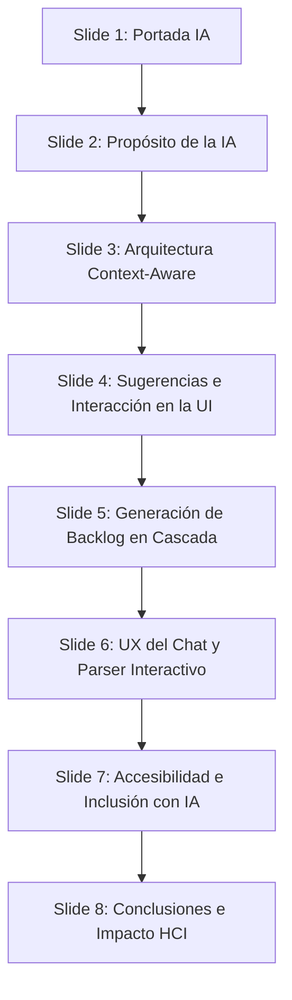

# Guion para Presentación de Diapositivas: Módulo de IA y Copiloto de Usabilidad 🧠🤖
**Asignatura:** Interacción Humano-Computador (HCI)  
**Proyecto:** Usability Test Dashboard 2.0  
**Enfoque de la presentación:** Integración de Inteligencia Artificial Contextual (Gemini API) y Soporte para Accesibilidad Web (WCAG)

Este guion está diseñado para una presentación corta de **8 diapositivas** enfocada exclusivamente en el diseño, la arquitectura y el impacto en usabilidad e inclusión (HCI) de nuestro Módulo de IA.

---

## Estructura de las Diapositivas de IA

---

### 🎴 Diapositiva 1: Portada y Presentación del Módulo de IA
* **Título de la diapositiva:** Copiloto de IA: Automatizando la Ingeniería de Usabilidad con Gemini API
* **Diseño Visual Sugerido:** 
  * Fondo azul oscuro con degradados en tonos púrpura (`#8B5CF6`) y cian.
  * Iconos grandes de cerebro digital e inteligencia artificial (`🧠🤖`).
  * Subtítulos modernos con tipografía estilizada.
* **Contenido Clave en Pantalla:**
  * **Asistente Contextual Integrado:** Integración activa en el ciclo de pruebas.
  * **Traducción Automática:** De observaciones sueltas de usabilidad a Sprint Backlogs funcionales.
  * **Enfoque de Accesibilidad:** Asistencia automatizada bajo pautas WCAG.
* **Guion del Orador (Exposición):**
  > "Buenos días. En esta presentación nos enfocaremos en el componente más innovador del *Usability Test Dashboard 2.0*: el **Módulo de Inteligencia Artificial**. Este módulo fue diseñado bajo principios de HCI para actuar como un 'par-evaluador' inteligente. El sistema no solo recolecta datos de usabilidad, sino que asiste al moderador y automatiza la traducción de observaciones complejas de interacción humana directamente en código y tareas de desarrollo de software utilizando la API de Gemini."
* **Término HCI Aplicado:** **Interacción Humano-IA** (colaboración simbiótica entre el sistema de inteligencia artificial y el especialista en usabilidad para mejorar la eficiencia del proceso de ingeniería de software).

---

### 🎴 Diapositiva 2: Propósito de la IA en la Ingeniería de Usabilidad
* **Título de la diapositiva:** ¿Por Qué Integrar IA en un Dashboard de Usabilidad?
* **Diseño Visual Sugerido:** 
  * Un contraste visual: A la izquierda, el flujo manual y pesado (guiones en papel, notas sueltas, transcripción a historias). A la derecha, el flujo asistido por IA (anotación en vivo, síntesis e importación en 1 clic).
  * Icono de rayo y chispas (`⚡✨`).
* **Contenido Clave en Pantalla:**
  * **Reducción de Carga Mental:** Menos esfuerzo cognitivo para el moderador durante la sesión.
  * **Cierre de Brecha Técnica:** Traducción inmediata de términos de usabilidad a historias Scrum técnicas.
  * **Generación de Valor:** Aceleración en la definición de planes y tareas correctivas.
* **Guion del Orador (Exposición):**
  > "Uno de los mayores cuellos de botella en las pruebas de usabilidad es la transcripción y mapeo de datos. Un moderador suele tomar docenas de notas cualitativas que luego debe estructurar manualmente en reportes y tareas para los desarrolladores. La IA en nuestro proyecto resuelve esto. Actúa reduciendo la carga cognitiva del evaluador y traduciendo instantáneamente las observaciones y hallazgos en historias de usuario estructuradas bajo estándares Scrum. Esto acelera el ciclo de vida del Diseño Centrado en el Usuario."
* **Término HCI Aplicado:** **Teoría de la Carga Cognitiva de Sweller** (diseño enfocado en reducir el esfuerzo mental extrínseco para liberar memoria de trabajo del usuario).

---

### 🎴 Diapositiva 3: Arquitectura Técnica y Flujo Context-Aware
* **Título de la diapositiva:** Arquitectura Context-Aware (Sensible al Contexto)
* **Diseño Visual Sugerido:** 
  * Diagrama de secuencia técnico y visual:
    `[UI React Pages] ➔ (Custom Event) ➔ [AiCopilot.tsx (JSON Context)] ➔ [SprintBacklogController.cs] ➔ [Gemini API]`
* **Contenido Clave en Pantalla:**
  * **Frontend Dinámico:** [AiCopilot.tsx](file:///D:/Proyectos/Univercidad/ExamenHCI/frontend_beta/src/components/AiCopilot.tsx) montado globalmente.
  * **Envío de Contexto:** El chat no es un prompt vacío; se envía automáticamente la pantalla activa y el JSON de datos en pantalla.
  * **Endpoint del Backend:** `/api/SprintBacklog/chat` en [SprintBacklogController.cs](file:///D:/Proyectos/Univercidad/ExamenHCI/UsabilityDashboard_API/Controllers/SprintBacklogController.cs).
* **Guion del Orador (Exposición):**
  > "Desde el punto de vista arquitectónico, no es un chatbot de uso genérico. Hemos diseñado una arquitectura *Context-Aware* (sensible al contexto). El componente visual `AiCopilot.tsx` se encuentra montado en el layout principal. Al abrirse, este recupera de forma reactiva los datos en formato JSON de la pantalla activa del usuario (por ejemplo, si está editando tareas o registrando observaciones). Estos datos se envían como metadatos al backend C#, el cual estructura un prompt enriquecido para la API de Gemini, garantizando respuestas precisas y adaptadas al momento de la interacción."
* **Término HCI Aplicado:** **Diseño Basado en el Contexto** (sistemas que adaptan sus respuestas y opciones basándose en el estado, la ubicación y las tareas actuales del usuario).

---

### 🎴 Diapositiva 4: Sugerencias Proactivas e Interacción en la UI
* **Título de la diapositiva:** Interfaz de Sugerencias Activas en la UI
* **Diseño Visual Sugerido:** 
  * Captura de pantalla de las vistas de Tareas, Hallazgos y Acciones de Mejora, destacando el botón flotante o botón con icono de destello: "Generar con IA".
  * Render de la sidebar abriéndose con la sugerencia cargando.
* **Contenido Clave en Pantalla:**
  * **Tasks.tsx:** El botón despacha el evento `suggest-tasks` para recibir escenarios ergonómicos de prueba.
  * **Findings.tsx:** Despacha `suggest-findings` para inferir hallazgos basados en observaciones e incidentes de sesiones.
  * **ImprovementActions.tsx:** Despacha `suggest-improvements` para recomendar soluciones a hallazgos.
* **Guion del Orador (Exposición):**
  > "La interacción en el frontend es fluida y no invasiva. En lugar de forzar al usuario a escribir comandos complejos en un chat, la UI expone botones contextuales de IA. En la pantalla de Tareas, un botón con icono de destello permite invocar al asistente para sugerir 3 tareas de usabilidad realistas basadas en el producto. Esto se logra mediante eventos personalizados de Javascript que abren la sidebar de forma reactiva e inician la solicitud con Gemini, manteniendo al usuario en control constante."
* **Heurísticas de Nielsen Aplicadas:** **Heurística #7 (Flexibilidad y eficiencia de uso)** mediante atajos interactivos que aceleran y enriquecen la entrada de información al sistema.

---

### 🎴 Diapositiva 5: Generación del Sprint Backlog en Cascada
* **Título de la diapositiva:** Generación Automatizada del Sprint Backlog
* **Diseño Visual Sugerido:** 
  * Un esquema de tuberías o cascada:
    `[Sesiones de Usuarios (Fallas, Tiempos)] ➔ [Filtro y Análisis en Cascada por IA] ➔ [Sprint Backlog (User Stories Scrum)]`
* **Contenido Clave en Pantalla:**
  * **Análisis en Cascada:** Recopila datos de TestPlan, tareas, observaciones registradas en sesiones y hallazgos.
  * **Estructura Scrum Estándar:** Historias en formato "Como... quiero... para..." con criterios y horas estimadas.
  * **Propiedad de Trazabilidad:** Inserción de la propiedad `origen_hallazgo` para mantener el hilo de diseño centrado en el usuario.
* **Guion del Orador (Exposición):**
  > "El mayor logro del asistente se ejecuta en el módulo del Backlog. Aquí implementamos un algoritmo de 'Análisis en Cascada'. La IA recopila el plan de pruebas, las tareas definidas y, críticamente, analiza los logs de observaciones de todas las sesiones de campo. Si detecta incidentes, los clasifica por severidad y los traduce autónomamente en historias de usuario Scrum. Cada historia conserva la trazabilidad de su origen (por ejemplo: 'Origen: Hallazgo #2 - Error de Contraste'), garantizando que cada línea de código a escribir responda a una evidencia real del test."
* **Término HCI Aplicado:** **Diseño Iterativo y Trazabilidad UX** (capacidad de mapear cada requerimiento técnico directamente con una fricción identificada en el usuario real).

---

### 🎴 Diapositiva 6: UX del Chat y Parser Interactivo (`[BACKLOG_ACTION]`)
* **Título de la diapositiva:** Interfaz Conversacional y Parser Interactivo
* **Diseño Visual Sugerido:** 
  * Captura de pantalla de la ventana de chat del Copiloto mostrando una tarjeta interactiva con checkboxes al lado de cada historia de usuario sugerida por la IA, y un botón para "Importar al Backlog".
* **Contenido Clave en Pantalla:**
  * **Parser de Tokens:** El chat de [AiCopilot.tsx](file:///D:/Proyectos/Univercidad/ExamenHCI/frontend_beta/src/components/AiCopilot.tsx) detecta etiquetas `[BACKLOG_ACTION]` y `[/BACKLOG_ACTION]`.
  * **Tarjetas Interactivas:** Transforma el JSON de la IA en componentes React renderizados con checks.
  * **Inserción sin Transcripción:** Selección y guardado directo en la base de datos con un clic.
* **Guion del Orador (Exposición):**
  > "Para evitar que el usuario deba copiar y pegar textos desde la consola de chat, diseñamos un mecanismo de comunicación basado en un parser interactivo. El backend de IA envuelve sus recomendaciones en etiquetas especiales llamadas `[BACKLOG_ACTION]`. El frontend React las intercepta y, en lugar de mostrar texto plano, renderiza dinámicamente tarjetas interactivas con casillas de verificación. El evaluador simplemente marca qué historias de usuario aprueba y, al hacer clic en 'Importar', se guardan en la base de datos al instante."
* **Término HCI Aplicado:** **Mapeo de Control e Interacción Directa** (interfaz que reduce la distancia de ejecución permitiendo al usuario manipular directamente los objetos sugeridos en pantalla).

---

### 🎴 Diapositiva 7: Accesibilidad e Inclusión Asistida por IA (Directrices WCAG)
* **Título de la diapositiva:** Accesibilidad e Inclusión Asistida por IA
* **Diseño Visual Sugerido:** 
  * Tarjetas informativas con iconos de accesibilidad (`♿ ShieldCheck`) vinculadas a pautas de contraste de color y lectores de pantalla.
* **Contenido Clave en Pantalla:**
  * **Análisis de Accesibilidad:** Procesamiento de logs provenientes de WAVE, Lighthouse y Stark.
  * **Recomendaciones de Código:** Sugerencia de cambios de código (como etiquetas `aria-label` o foco visible).
  * **Enfoque Inclusivo:** Alineación con los niveles de conformidad A, AA, AAA de la directriz WCAG.
* **Guion del Orador (Exposición):**
  > "La usabilidad y la accesibilidad van de la mano. En nuestro sistema, el Módulo de IA no solo optimiza flujos de tareas, sino que asiste al evaluador en el cumplimiento de las pautas de accesibilidad web WCAG. La IA procesa los registros de hallazgos cargados mediante herramientas como WAVE, Lighthouse y Stark, infiriendo problemas de inclusión (como la falta de contraste de texto o de descripciones para lectores de pantalla) y sugiriendo recomendaciones correctivas técnicas concretas. Esto facilita enormemente la creación de software equitativo y accesible."
* **Término HCI Aplicado:** **Accesibilidad Web / Inclusión** (diseño enfocado en eliminar barreras de interacción para personas con capacidades diversas) y **Conformidad WCAG**.

---

### 🎴 Diapositiva 8: Conclusiones e Impacto en HCI
* **Título de la diapositiva:** Conclusiones: IA y el Futuro de la Usabilidad
* **Diseño Visual Sugerido:** 
  * Fondo azul oscuro con degradados en púrpura y cian, combinando con la portada.
  * Iconos de victoria y preguntas (`🏆❓`).
* **Contenido Clave en Pantalla:**
  * **Eficiencia Incrementada:** Ahorro radical de tiempo en la transcripción de observaciones.
  * **Soporte Educativo y Profesional:** Guía interactiva que enseña terminología de HCI y Scrum en vivo.
  * **Demostración en Vivo:** Invitación a ver el asistente interactuando en tiempo real.
* **Guion del Orador (Exposición):**
  > "En conclusión, el módulo de IA del Usability Test Dashboard 2.0 redefine cómo se ejecutan las evaluaciones de usabilidad. Demuestra cómo la IA puede actuar como un puente directo entre el análisis cualitativo humano y la ingeniería de software cuantitativa. A través de sugerencias en vivo y la generación automatizada de backlogs con un parser interactivo, logramos un sistema ergonómico y altamente eficiente. A continuación, procederemos con la demostración en vivo del Copiloto de IA para observar su comportamiento en tiempo real. Muchas gracias por su atención."
* **Términos HCI Aplicados:** **Sistemas Colaborativos Inteligentes**, **Usabilidad del Ecosistema** y **Trazabilidad en el Diseño Centrado en el Usuario (DCU)**.

---

> [!TIP]
> **Recomendaciones para la Demostración Práctica:**
> 1. Inicia sesión en el frontend, navega al listado de **Tareas**, y haz clic en "Sugerir tareas" para mostrar cómo se abre la sidebar con animaciones fluidas y carga las sugerencias dinámicamente.
> 2. Muestra la sección del **Sprint Backlog** y haz clic en "Generar Backlog". Explica el flujo en cascada mientras se muestran los pasos de carga en pantalla: *1. Analizando sesiones, 2. Identificando hallazgos, 3. Estructurando historias.*
